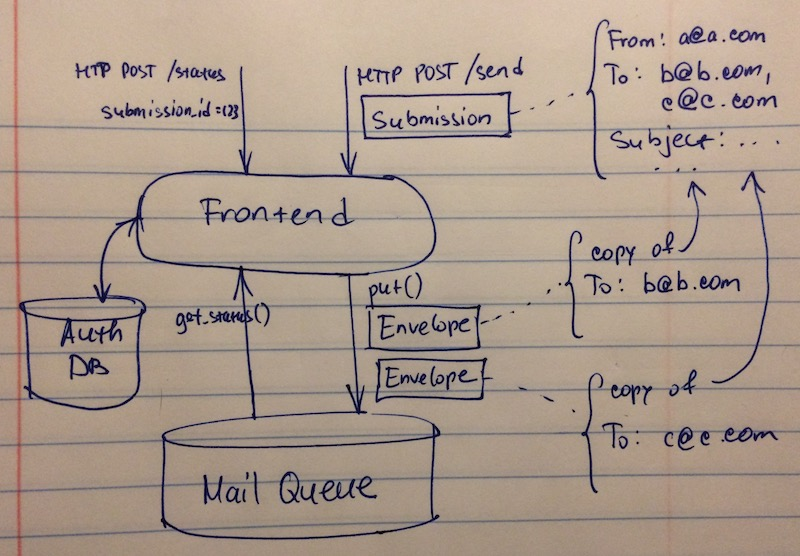

# Mini-MailGun

This simple service accepts requests to send email (as JSON-formatted HTTP POST requests) and
relays them to appropriate mail exchanges (MXs) with SMTP.

Prerequisites:

 - UNIX-like OS (tested on macOS 10.12.6)
 - Docker with `docker-compose` supporting
 [version 3](https://docs.docker.com/compose/compose-file/) configuration files
 - Python 3 (to run end-to-end tests)
 - Shell

# How To Build

Running

    $ ./build.sh

...will build a Docker image named `mini-mailgun/bundle` which contains all components of the
system.

# How To Run Unit Tests

Once the image is built, you can run unit tests by running the image like this:

    $ docker run --rm -it mini-mailgun/bundle

Unit tests should never fail.

# How To Run End-To-End Test

First, change directory to `e2e-tests`.

If you've already run the end-to-end test, you might want to clean up the state by running the
`cleanup.sh` script:

    $ cd e2e-tests
    $ ./cleanup.sh

The test setup is structured like this:

Start up the system in the test harness:

    $ docker-compose up

Once it's up and running (you should see a message similar to "`Attaching to e2etests_smtpstub_1,
e2etests_sender_1, e2etests_frontend_1`"), run the test in another terminal window:

    $ ./e2e-test.py

To stop the system, abort `docker-compose` with `Ctrl-C` and remove the containers:

    $ docker-compose rm -fv

Due to the asynchronous nature of the setup, end-to-end tests will sometimes fail. Unlike unit
tests, where failures indicate issues in the code with certainty, failures of the end-to-end tests
need interpretation: sometime it's just unfortunate timing. The end-to-end suite can be improved,
but I decided not to invest time in it at this point.

# HTTP API

I'm assuming that the system will be deployed behind a load balancer which terminates HTTPS. Thus
it exposes HTTP API and requests/responses might contain sensitive information.

## Authentication

Clients are authenticated by including a secret token (`client_id`) into requests. This token
uniquely identifies client's data within the system.

This has to be changed in the next version: clients should have stable permanent identifiers and
revokable secrets for authentication.

## POST /send

The body of the request should be a JSON object of the following structure:

    {
        "sender": "me@example.com",
        "recipients": ["alice@another.com", "bob@third.com"],
        "subject": "important message",
        "body": "hello!"
    }

The system responds with a `200` status code if the message has been queued successfully. The
response is structured like this:

    {
        "result": "queued",
        "submission_id": "d0c539ee71a649528ed59c1a0e419afa"
    }

The `submission_id` is a unique identifier which can be used later to query the status of the
submission.

## POST /status

The body of the request should be a JSON object of the following structure:

    {
        "submission_id": "d0c539ee71a649528ed59c1a0e419afa"
    }

The response is a JSON object like this:

    {
        "result": "success",
        "status": "sent"
    }

`status` may be one of:
 * `queued`: there is at least one recipient for whom the message has not yet been relayed to the
 mail exchange
 * `sent`: the message has been relayed to all recipients (it doesn't mean it has been delivered
 though)

In case of error the response is of the following format:

    {
        "result": "error",
        "message": "Human-readable diagnostic message"
    }

# System Design

Here's the high level system structure:

## Frontend

The job of the frontend is to authenticate client requests, parse and validate input, represent
incoming requests as internal entities and store them in the mail queue.

A single incoming request can include recipients of different domains (e.g. `b1@b.com`, `b2@b.com`
and `c@c.com`) so the frontend groups them into envelopes. An envelope lists all recipients of the
incoming request that belong to the same domain (e.g. one envelope lists `b1@b.com`, `b2@b.com`,
another lists `c@c.com`; both reference the original message).

Each envelope (along with the message formed from the incoming request) will be delivered to its
own SMTP server. Delivery attempts are tracked per envelope.

In the current version frontend uses plain text file `/conf/clients` as its authentication
database. The file lists known client identifiers.

## Sender

Here's a rough sketch of the `sender` process design:

## Cleaner

Cleaner is a separate container which implements retention policy for client submissions statuses.

## Choices

I chose to use SQLite3 to store mail queue between the `frontend` and `sender`. It's embedded
(requires no additional components) and provides transactional properties when persisting messages.
It's also battle-tested for crash scenarios and provides rich query/update semantics.

Each envelope contains the original message text as RFC822. I traded space (database size) for
simplicity (having to deal with a single table).

## Scaling

To scale frontends of this architecture, one can just run multiple `frontend` containers sharing
the same database volume. SQLite3 will serialize writes.

It is possible to run multiple senders in a sharded configuration (unique envelope id acts as the
sharding key).

This will work until database contention becomes too high. At that point the next step might be to
shard on writes (e.g. use multiple databases with customer id as sharding key).

Another avenue for improvement is to batch multiple messages over the same SMTP connection, to
keep per-MX availability status (e.g. avoid delivery to an MX which is known to be unavailable),
cache DNS lookups and use other smart strategies.
