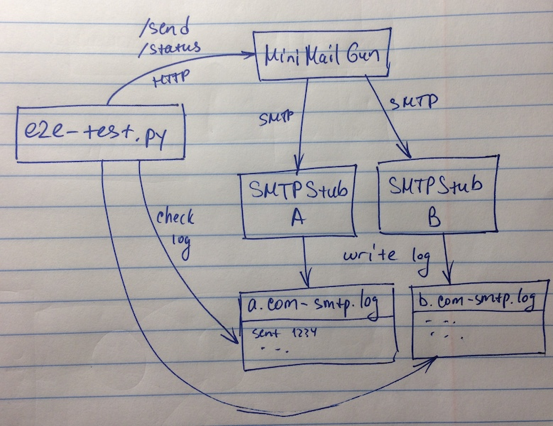

# Mini-MailGun

This simple service accepts requests to send email (as JSON-formatted HTTP POST requests) and
relays them to an upstream SMTP server.

Prerequisites:
 * UNIX-like OS (tested on macOS 10.12.6)
 * Docker with `docker-compose` supporting
 [version 3](https://docs.docker.com/compose/compose-file/) configuration files
 * curl
 * Shell

# How To Build

Running

    $ ./build.sh

...will build a Docker image named `mini-mailgun/bundle` which contains all components of the
system.

# How To Run Unit Tests

Once the image is built, you can run unit tests by running the image like this:

    $ docker run --rm -it mini-mailgun/bundle

# How To Run End-To-End Test

First, change directory to `e2e-tests`.

If you've already run the end-to-end test, you might want to clean up the state by running the
`cleanup.sh` script:

    $ cd e2e-tests
    $ ./cleanup.sh

The test setup is structured like this:



Start up the system in the test harness:

    $ docker-compose up

Once it's up and running (you should see a message similar to "`Attaching to e2etests_smtpstub_1,
e2etests_sender_1, e2etests_frontend_1`"), run the test in another terminal window:

    $ ./test.sh

Exit code of this script indicates whether the test was successful.

To stop the system, abort `docker-compose` with `Ctrl-C` and remove the containers:

    $ docker-compose rm -fv

# HTTP API

The service expects an HTTP POST request at the `/send` endpoint. The body of the POST request
should be a JSON object of the following structure:

```
{
    "sender": "me@example.com",
    "recipients": "alice@another.com, bob@third.com",
    "subject": "important message",
    "body": "hello!"
}
```

The system responds with a `200` status code if the message has been queued successfully.

# System Design

Here's the overall system structure:


## Assumptions

In the real world a pool of SMTP servers would take care of queuing email, making decisions on next
hop for delivery (e.g. by looking up an MX record or picking a preconfigured upstream SMTP server),
attempting deliveries, bouncing undeliverable email and retrying deliveries after temporary
failures.

There is no value in reimplementing this functionality when production-grade solutions exist.
Therefore I assume that the point of the system being designed is to:
 * provide clients with an HTTP interface for sending email
 * persistently queue client requests for cases when backend SMTP server pool is not available
 * allow for scaling of HTTP frontends
 * allow for performance gains when delivering to backends (e.g. reuse TCP connections, parallel
 delivery etc)

## Choices

I chose to use SQLite3 to store mail queue between the `frontend` and `sender`. It's embedded
(requires no additional components) and provides transactional properties when persisting messages.
It's also battle-tested for crash scenarios. It provides rich semantics that can be used later
(e.g. sort by timestamp, select only messages for particular shard etc).

Messages are persisted as RFC822 text and are uniquely identified by SQLite's `rowid`.

## Scaling

To scale frontends of this architecture, one can just run multiple `frontend` containers sharing
the same database volume. SQLite3 will serialize writes.

To scale the number of senders, we'll need to implement sharding logic in those components.

This will work until database contention becomes too high. At that point the next step might be to
shard on writes (e.g. use multiple databases).

Another avenue for improvement is to increase concurrency in the senders (e.g. run multiple
threads) or to batch multiple messages over the same SMTP connection.

# Limitations And Possible Improvements

This version of the system is primitive and can be improved in a number of ways. Here are some:

 - Properly validate input and provide useful diagnostics
 - Support a pool of backend SMTP servers
 - Provide the client with an API to query the status of the previously sent email
 - Add logging
 - Handle scenarios where the backend SMTP server fails (retries with exponential backoff)
 - Handle scenarios where a particular email can't be delivered temporarily (schedule another
 delivery attempt later) or permanently (mark the message as undeliverable)
 - Provide structured error responses for HTTP requests (use JSON instead of HTML)
 - Correctly handle multiple recipients in requests
 - Handle MIME-encoded messages (not just plain text)

# TODO

- address all TODOs
- get actual sender, recipient and body from posted json
